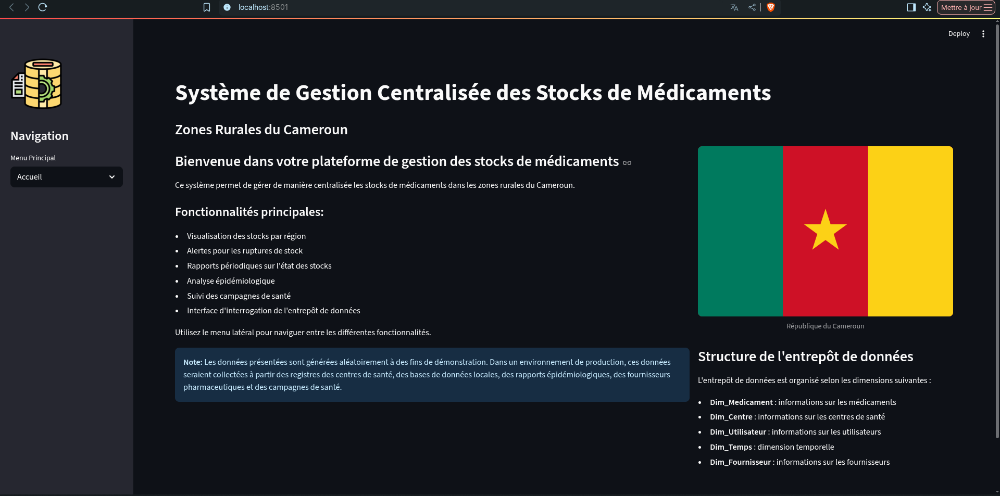

# Système de Gestion Centralisée des Stocks de Médicaments


## Présentation du projet

Ce projet est une plateforme de gestion centralisée des stocks de médicaments, pensée pour les zones rurales du Cameroun.  
Elle permet de visualiser, analyser et suivre les stocks, les alertes, les campagnes de santé et les données épidémiologiques à travers une interface interactive basée sur [Streamlit](https://streamlit.io/).

### Fonctionnalités principales

- Visualisation des stocks par région
- Alertes pour les ruptures de stock
- Rapports périodiques sur l'état des stocks
- Analyse épidémiologique
- Suivi des campagnes de santé
- Interface d'interrogation de l'entrepôt de données
- Gestion et visualisation des différentes dimensions de l'entrepôt

---

## Prérequis

- Python 3.8 ou supérieur
- [git](https://git-scm.com/)
- Accès à internet pour installer les dépendances

---

## Installation et lancement

1. **Cloner le dépôt GitHub :**

   ```bash
   git clone https://github.com/FredieBrunn/data-warehouse-gestion-centralise-stocks-medicaments.git
   cd data-warehouse-gestion-centralise-stocks-medicaments/
   ```
2. **(Optionnel) Créer un environnement virtuel:**
    ```bash
    python -m venv env
    source venv/bin/activate
    ```
3. **Installer les dépendances:**
    ```bash
    pip install -r requirements.txt
    ```
4. **Lancer L'application :**
    ```bash
    streamlit run app.py
    ```
5. **Ouvrir le lien fourni par Streamlit dans votre navigateur**

---

## Structure de l'entrepôt de données

L'entrepôt de données est organise selon les dimensions suivantes:

- **Dim_Medicament** : informations sur les médicaments
- **Dim_Centre** : informations sur les centres de santé
- **Dim_Utilisateur** : informations sur les utilisateurs
- **Dim_Temps** : dimension temporelle
- **Dim_Fournisseur** : informations sur les fournisseurs

---

## Remarque

- Les données affichées sont générées aléatoirement à des fins de démonstration.
- Pour lier votre dépôt local à GitHub, utilisez la commande suivante :

  ```bash
  git remote add origin https://github.com/FredieBrunn/data-warehouse-gestion-centralise-stocks-medicaments.git
  ```

---

## Aperçu de l'interface



---

**Auteur :** Fredie Brunn